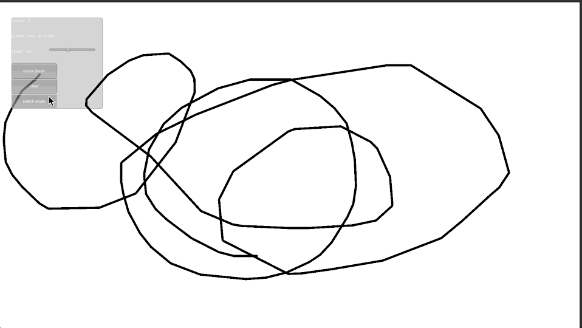
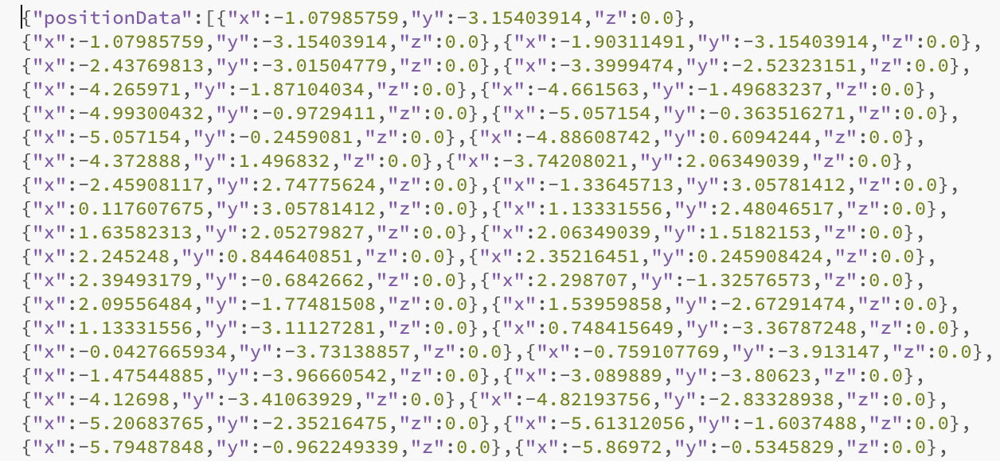

# Unity3D_DrawLineAnimator

    
a demo show how to draw line and save it to a record for animation

    <h1>How to draw line</h1>
    
    <h1>How to animate record</h1>
    
    <h1><a href="LineData/positionData.json">line record preview</a></h1>
    
Basically it's just a bunch of position data

    
    
Collaborate with <a href="https://github.com/AaronXue0?tab=overview&from=2021-04-01&to=2021-04-22">AaronXue0</a>

